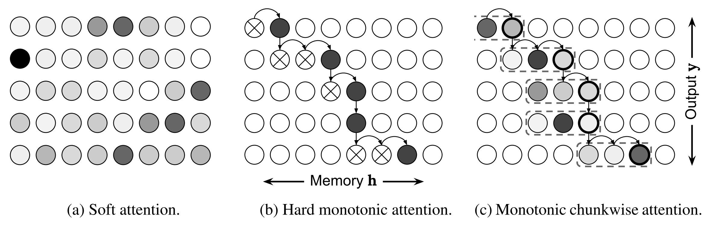

# PyTorch Implementation of [Monotonic Chunkwise Attention](https://openreview.net/forum?id=Hko85plCW)

## Requirements
- PyTorch 0.4

## TODOs
- [x] Soft MoChA
- [x] Hard MoChA
- [ ] Linear Time Decoding
- [ ] Experiment with Real-world dataset

## Model figure

## Linear Time Decoding
It's not clear if [authors' TF implementation](https://github.com/craffel/mad/blob/master/example_decoder.py#L235) supports decoding in linear time.
They calculate energies for **whole encoder outputs** instead of scanning from previously attended encoder output.

## References
- Colin Raffel, Minh-Thang Luong, Peter J. Liu, Ron J. Weiss and Douglas Eck. [Online and Linear-Time Attention by Enforcing Monotonic Alignments](http://arxiv.org/abs/1704.00784) (ICML 2017)
- Chung-Cheng Chiu and Colin Raffel. [Monotonic Chunkwise Attention](https://openreview.net/forum?id=Hko85plCW) (ICLR 2018)
